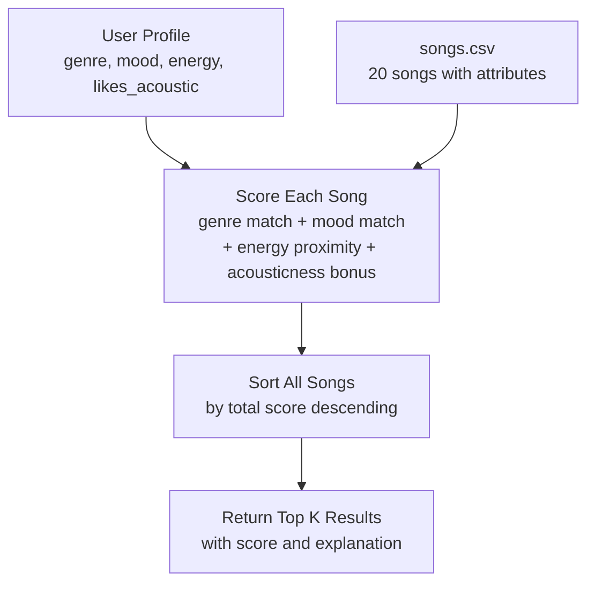

# 🎵 Music Recommender Simulation

## Project Summary

This project simulates a content-based music recommender system. Given a user's preferred genre, mood, and energy level, the system scores every song in a 20-song catalog and returns the top matches. It mirrors how real platforms like Spotify use song attributes — rather than other users' behavior — to suggest new music.

My version prioritizes genre and mood as the strongest signals of taste, with energy proximity as a fine-tuning factor. A small acousticness bonus rewards songs that match whether the listener prefers organic or produced sounds.

---

## How The System Works

### Real-World Context

Real recommendation systems like Spotify use two main strategies:

- **Collaborative filtering** — "Users who liked what you like also liked X." The system finds listeners with similar behavior (plays, skips, saves) and recommends what they enjoyed. It does not need to understand what the music actually sounds like.
- **Content-based filtering** — "This song has the same attributes as songs you already like." The system analyzes audio features like tempo, energy, and mood and finds songs that are numerically similar to the user's profile.

This simulation uses **content-based filtering**. It works with structured data: each song has labeled attributes, and the user provides target values. The system scores every song in the catalog based on how closely it matches those targets, then returns the highest scorers.

The main data types in real systems include: explicit signals (likes, skips, saves, playlist adds) and implicit signals (listen duration, replay rate, time of day). On the song side: tempo, key, energy, valence, danceability, genre tags, and mood labels.

---

### Features Each Song Uses

| Feature | Type | Description |
|---|---|---|
| `genre` | categorical | Broad category: pop, lofi, rock, jazz, hip-hop, etc. |
| `mood` | categorical | Emotional tone: happy, chill, intense, relaxed, moody, etc. |
| `energy` | numeric (0–1) | How energetic the track feels |
| `acousticness` | numeric (0–1) | How acoustic vs. electronically produced the track sounds |

*`tempo_bpm`, `valence`, and `danceability` are in the dataset but not yet used in scoring — identified as a future improvement.*

---

### UserProfile Stores

- `favorite_genre` — the genre the user enjoys most
- `favorite_mood` — the mood the user prefers
- `target_energy` — ideal energy level (0.0 = very calm, 1.0 = very intense)
- `likes_acoustic` — whether the user prefers acoustic or produced sounds

---

### Algorithm Recipe (Scoring a Single Song)

| Feature | Rule | Max Points |
|---|---|---|
| Genre | +2.0 if exact match | 2.0 |
| Mood | +1.5 if exact match | 1.5 |
| Energy | `1.0 × (1 − |target − song_energy|)` — rewards closeness | 1.0 |
| Acousticness | `0.5 × acousticness` if `likes_acoustic`, else `0.5 × (1 − acousticness)` | 0.5 |
| **Total possible** | | **5.0** |

Genre is weighted highest because it is the broadest signal of taste. A jazz listener and a metal listener have almost no overlap regardless of mood or energy. Mood is second because it captures the emotional intent of the session. Energy is continuous so it uses a proximity formula instead of an exact match.

**Potential bias to watch for:** Genre dominance means a song that matches genre but has the wrong energy can outscore a song that perfectly matches energy and mood but differs in genre. This could prevent discovery across genres the user hasn't tried yet.

---

### Ranking Rule

After every song is scored, the full list is sorted from highest to lowest score. The top `k` songs (default 5) are returned along with a plain-language explanation of why each was selected.

**Why we need both rules separately:**
- The *scoring rule* answers: "How good is this one song for this user?"
- The *ranking rule* answers: "Given all the scores, which songs should I actually show?"

They are separate because the ranking step can be swapped out independently — for example, you could add diversity logic (no two songs from the same genre) without touching how individual songs are scored.

---

### Data Flow Diagram



---

## Getting Started

### Setup

Create a virtual environment (optional but recommended):

```bash
python -m venv .venv
source .venv/bin/activate      # Mac or Linux
.venv\Scripts\activate         # Windows
```

Install dependencies:

```bash
pip install -r requirements.txt
```

Run the app:

```bash
python -m src.main
```

---

## Running Tests

```bash
pytest
```

---

## Experiments You Tried

- **Genre weight 2.0 → 0.5:** The top results became more mixed — a chill lofi track could outrank a pop song for a pop-preferring user if the energy was a slightly better match. Genre matching lost its dominance. Confirmed that genre weight is the biggest lever in the system.
- **Adding acousticness:** Users with `likes_acoustic=True` started surfacing jazz, folk, and lofi tracks over pop and synthwave, which felt intuitive.
- **High-energy user profile (`energy=0.95`):** The metal track "Burning Canvas" and rock track "Storm Runner" rose to the top, which matched expectations for an intense listener.
- **Low-energy/chill user profile (`energy=0.3`):** Folk, ambient, and lofi tracks dominated. Jazz also appeared due to its soft acousticness — a pleasant discovery effect.
- **Latin user profile (`genre=latin, mood=happy`):** "Cumbia del Sol" ranked first by a large margin. Only one latin song in the catalog means the second result fell back to mood-matching songs in other genres.

---

## Limitations and Risks

- Only 20 songs — most genres appear once or twice, so genre-matching users get limited real choice.
- Exact-match genre scoring means "indie pop" and "pop" score zero genre overlap even though they are closely related.
- `tempo_bpm`, `valence`, and `danceability` are in the dataset but unused — two songs with very different grooves can receive identical scores.
- No listening history — the system cannot adapt to what users actually play or skip.
- The catalog skews toward Western, English-language genres. Users whose taste centers on K-pop, Afrobeats, classical, or other traditions are underserved.

---

## Reflection

Content-based recommenders turn song attributes into numbers and then turn those numbers into a ranking. The key insight is that a score is just a measure of similarity — the closer a song is to the user's stated preferences across multiple dimensions, the higher it ranks. The system doesn't "understand" music; it just does math on labeled columns.

Bias can appear in subtle ways. If the catalog over-represents certain genres, those genres have more candidates to win recommendations. A user who loves jazz or ambient music gets a thinner set of options. Exact-match genre scoring also means that subgenres or cultural music styles not in the catalog are invisible to the system entirely — a real fairness concern at scale.
